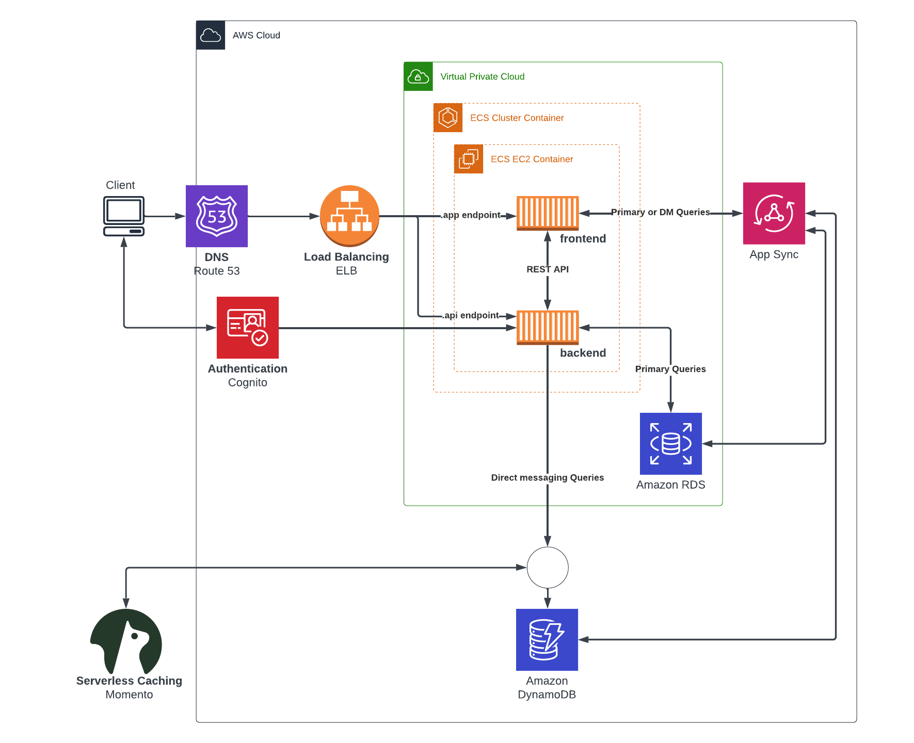
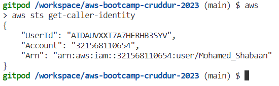
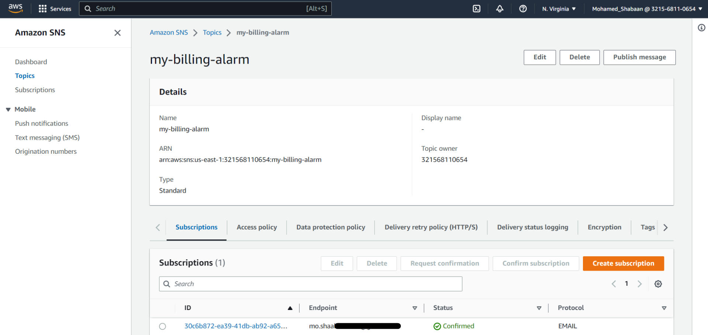
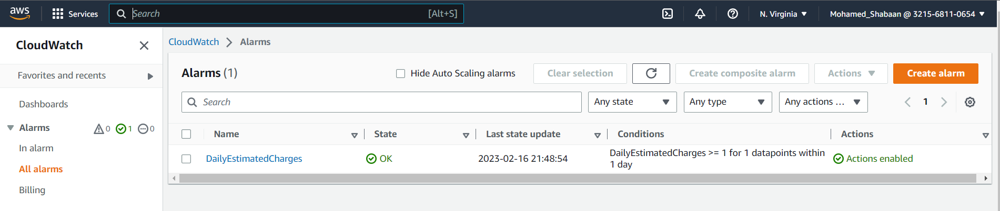

# Week 0 — Billing and Architecture
## Required Homework

- ### Conceptual Diagram


- ### Logical Architecture diagram using Lucid Charts

[Link to the chart](https://lucid.app/lucidchart/87d403d6-fe87-4485-a390-e85e5b337999/edit?viewport_loc=-310%2C18%2C2560%2C1216%2C0_0&invitationId=inv_5b59f24d-f3f4-4965-94fb-e4bc6d4053bb)

- ### Creating an IAM admin user


- ### Generating AWS Credentials to be used with Gitpod


- ### Installing AWS CLI on Gitpod
1) referring to this [doc](https://docs.aws.amazon.com/cli/latest/userguide/cli-configure-envvars.html) for instructions to configure AWS CLI using env vars
  Either via CLI:
  ``` gp env NAME=VALUE ```
  or via GUI:

  
  
2) Editing the [.gitpod.yml](../.gitpod.yml) file to insert task for AWS CLI installation
   ```yml
    tasks:
      - name: aws-cli
        env:
          AWS_CLI_AUTO_PROMPT: on-partial
        init: |
          cd /workspace
          curl "https://awscli.amazonaws.com/awscli-exe-linux-x86_64.zip" -o "awscliv2.zip"
          unzip awscliv2.zip
          sudo ./aws/install
          rm awscliv2.zip
          cd $THEIA_WORKSPACE_ROOT
    vscode:
      extensions:
        - 42Crunch.vscode-openapi
   ```
3) Verifying that AWS CLI is working:

    
    
    
- ### Creating an AWS Budget
via GUI:
  
or via CLI:
by referring to AWS CLI [docs](https://awscli.amazonaws.com/v2/documentation/api/latest/reference/budgets/create-budget.html#examples)
1) Creating a ```budget.json``` file
```json
{
    "BudgetLimit": {
        "Amount": "5",
        "Unit": "USD"
    },
    "BudgetName": "Example CLI Budget",
    "BudgetType": "COST",
    "CostFilters": {
        "TagKeyValue": [
            "user:Key$value1",
            "user:Key$value2"
        ]
    },
    "CostTypes": {
        "IncludeCredit": true,
        "IncludeDiscount": true,
        "IncludeOtherSubscription": true,
        "IncludeRecurring": true,
        "IncludeRefund": true,
        "IncludeSubscription": true,
        "IncludeSupport": true,
        "IncludeTax": true,
        "IncludeUpfront": true,
        "UseBlended": false
    },
    "TimePeriod": {
        "Start": 1477958399,
        "End": 3706473600
    },
    "TimeUnit": "MONTHLY"
}
```
2) Creating a  ```notifications-with-subscribers.json``` file
```json
[
    {
        "Notification": {
            "ComparisonOperator": "GREATER_THAN",
            "NotificationType": "ACTUAL",
            "Threshold": 75,
            "ThresholdType": "PERCENTAGE"
        },
        "Subscribers": [
            {
                "Address": "mo.shaa_____",
                "SubscriptionType": "EMAIL"
            }
        ]
    }
]
```
3) Get the account-id ```export ACCOUNT_ID=$(aws sts get-caller-identity --query Account --output text)```
4) Running this command to Create a Budget
  ```
  aws budgets create-budget \
    --account-id $ACCOUNT_ID \
    --budget file://json/budget.json \
    --notifications-with-subscribers file://json/notifications-with-subscribers.json
   ```
  
  
  
- ### Creating a Billing Alarm
1) Create an SNS [topic](https://awscli.amazonaws.com/v2/documentation/api/latest/reference/sns/create-topic.html#examples)
``` 
aws sns create-topic --name my-billing-alarm
```
2) [Subscribe](https://awscli.amazonaws.com/v2/documentation/api/latest/reference/sns/subscribe.html) to that SNS topic
```
aws sns subscribe \
    --topic-arn $(aws sns create-topic --name my-billing-alarm --query TopicArn --output text) \
    --protocol email \
    --notification-endpoint mo.shaa___
```
3) Confirm the pending subscription


4) Create an Alarm via Cloud Watch
Creating a ```billing-alarm.json``` file
```json
{
    "AlarmName": "DailyEstimatedCharges",
    "AlarmDescription": "This alarm would be triggered if the daily estimated charges exceeds 1$",
    "ActionsEnabled": true,
    "AlarmActions": [
        "arn:aws:sns:us-east-1:321568110654:my-billing-alarm"
    ],
    "EvaluationPeriods": 1,
    "DatapointsToAlarm": 1,
    "Threshold": 1,
    "ComparisonOperator": "GreaterThanOrEqualToThreshold",
    "TreatMissingData": "breaching",
    "Metrics": [{
        "Id": "m1",
        "MetricStat": {
            "Metric": {
                "Namespace": "AWS/Billing",
                "MetricName": "EstimatedCharges",
                "Dimensions": [{
                    "Name": "Currency",
                    "Value": "USD"
                }]
            },
            "Period": 86400,
            "Stat": "Maximum"
        },
        "ReturnData": false
    },
    {
        "Id": "e1",
        "Expression": "IF(RATE(m1)>0,RATE(m1)*86400,0)",
        "Label": "DailyEstimatedCharges",
        "ReturnData": true
    }]
  }
```
By referring to this [doc](https://awscli.amazonaws.com/v2/documentation/api/latest/reference/cloudwatch/put-metric-alarm.html#examples) 
we can create a billing alarm by running this command
``` aws cloudwatch put-metric-alarm --cli-input-json file://json/billing-alarm.json ```

  
## Additional Challenges
