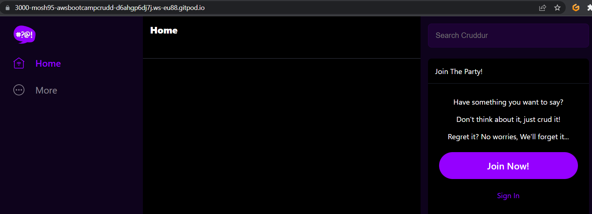

# Week 1 — App Containerization
# Required Homework
## Running Python App:
first we need to install the required modules and load the required Env Vars.

the ```requirements.txt``` file includes ```flask``` and ```flask-cors``` modules
```sh
cd backend-flask
pip3 install -r requirements.txt
export FRONTEND_URL="*"
export BACKEND_URL="*"
python3 -m flask run --host=0.0.0.0 --port=4567
```
Make sure the port is public then append ```/api/activities/home``` to the service url.

the output:


## The backend:

### Creating the ```Dockerfile```:
```dockerfile
FROM python:3.10-slim-buster
WORKDIR /backend-flask
COPY . .
RUN pip3 install -r requirements.txt
ENV FLASK_ENV=development
EXPOSE ${PORT}
CMD [ "python3", "-m" , "flask", "run", "--host=0.0.0.0", "--port=4567"]
```
### Building the image:
```sh
docker build -t backend-flask .
```
since we didn't define the variables for the exposed port or the frontend and backend URLs, we need to define them via CLI while running the backend container in the background:
```sh
docker run --rm -p 4567:4567 -d -e FRONTEND_URL='*' -e BACKEND_URL='*' backend-flask
```
### Verifying that the container is running:


Verifying that we can hit the backend:
via the browser


or via a CURL command:
```sh
curl -X GET http://localhost:4567/api/activities/home -H "Accept: application/json" -H "Content-Type: application/json"
```


## The Frontend:
### Prerequisites:
Installing all the required packages defined in the ```package.json``` file:
```sh
cd frontend-react-js
npm i
```
### Creating the ```Dockerfile```:
```dockerfile
FROM node:16.18
WORKDIR /frontend-react-js
COPY . .
RUN npm i
EXPOSE ${PORT}
CMD ["npm", "start"]
```
### Building the image:
```sh
docker build -t frontend-react-js .
```
### Running the frontend container in the background:
```sh
docker run -p 3000:3000 -d frontend-react-js
```
### verify that port 3000 is public then verify that you can hit the frontend service URL



## Utilizing Docker Compose in building our application (Alternative approach instead of managing containers individually):
### Creating a ```docker-compose.yml``` file
```yml
version: "3.8"
services:
  backend-flask:
    environment:
      FRONTEND_URL: "https://3000-${GITPOD_WORKSPACE_ID}.${GITPOD_WORKSPACE_CLUSTER_HOST}"
      BACKEND_URL: "https://4567-${GITPOD_WORKSPACE_ID}.${GITPOD_WORKSPACE_CLUSTER_HOST}"
    build: ./backend-flask
    ports:
      - "4567:4567"
    volumes:
      - ./backend-flask:/backend-flask
  frontend-react-js:
    environment:
      REACT_APP_BACKEND_URL: "https://4567-${GITPOD_WORKSPACE_ID}.${GITPOD_WORKSPACE_CLUSTER_HOST}"
    build: ./frontend-react-js
    ports:
      - "3000:3000"
    volumes:
      - ./frontend-react-js:/frontend-react-js

# the name flag is a hack to change the default prepend folder
# name when outputting the image names
networks: 
  internal-network:
    driver: bridge
    name: cruddur
```
### Creating the ```DynamoDB``` and ```Postgres``` Containers in the same ```docker-compose.yml``` file
since we are going to use both locally, we can append these sections to the docker-compose.yml file as well:

#### Postgres
```yml
services:
  db:
    image: postgres:13-alpine
    restart: always
    environment:
      - POSTGRES_USER=postgres
      - POSTGRES_PASSWORD=password
    ports:
      - '5432:5432'
    volumes: 
      - db:/var/lib/postgresql/data
volumes:
  # named volume
  db:
    driver: local
```
Installing Postgres client into Gitpod:
vim ```.gitpod.yml```:
add the following section as a Gitpod task:
```sh
  - name: postgres
    init: |
      curl -fsSL https://www.postgresql.org/media/keys/ACCC4CF8.asc| sudo gpg --dearmor -o /etc/apt/trusted.gpg.d/postgresql.gpg
      echo "deb http://apt.postgresql.org/pub/repos/apt/ `lsb_release -cs`-pgdg main" | sudo tee  /etc/apt/sources.list.d/pgdg.list
      sudo apt update
      sudo apt install -y postgresql-client-13 libpq-dev
```
To see the .gitpod.yml in action you need to commit and push the file then create a new workspace **or** you can type these lines in the CLI:
create this file ```script.sh```
```sh
curl -fsSL https://www.postgresql.org/media/keys/ACCC4CF8.asc| sudo gpg --dearmor -o /etc/apt/trusted.gpg.d/postgresql.gpg
      echo "deb http://apt.postgresql.org/pub/repos/apt/ `lsb_release -cs`-pgdg main" | sudo tee  /etc/apt/sources.list.d/pgdg.list
      sudo apt update
      sudo apt install -y postgresql-client-13 libpq-dev
```
then
```sh
chmod u+x script.sh && ./script.sh && rm -f ./script.sh
```

verifying that the psql client is installed:

```sh 
psql --version
```


#### DynamoDB
```yml
services:
  dynamodb-local:
    # https://stackoverflow.com/questions/67533058/persist-local-dynamodb-data-in-volumes-lack-permission-unable-to-open-databa
    # We needed to add user:root to get this working.
    user: root
    command: "-jar DynamoDBLocal.jar -sharedDb -dbPath ./data"
    image: "amazon/dynamodb-local:latest"
    container_name: dynamodb-local
    ports:
      - "8000:8000"
    volumes:
      # directory volume mapping
      - "./docker/dynamodb:/home/dynamodblocal/data"
    working_dir: /home/dynamodblocal
```
### Verifying that the Application is running
```sh
docker compose up
```


## Working with DynamoDB
By referring to this [repo](https://github.com/100DaysOfCloud/challenge-dynamodb-local) for information about working with DynamoDB

### Creating a dynamoDB table
```sh
aws dynamodb create-table \
    --endpoint-url http://localhost:8000 \
    --table-name Music \
    --attribute-definitions \
        AttributeName=Artist,AttributeType=S \
        AttributeName=SongTitle,AttributeType=S \
    --key-schema AttributeName=Artist,KeyType=HASH AttributeName=SongTitle,KeyType=RANGE \
    --provisioned-throughput ReadCapacityUnits=1,WriteCapacityUnits=1 \
    --table-class STANDARD
```

### Populating it with an item
```sh
aws dynamodb put-item \
    --endpoint-url http://localhost:8000 \
    --table-name Music \
    --item \
        '{"Artist": {"S": "No One You Know"}, "SongTitle": {"S": "Call Me Today"}, "AlbumTitle": {"S": "Somewhat Famous"}}' \
    --return-consumed-capacity TOTAL  
```

### Listing the table
```sh
aws dynamodb list-tables --endpoint-url http://localhost:8000
```
### Querying records
```sh
aws dynamodb scan --table-name Music --query "Items" --endpoint-url http://localhost:8000
```


## Working with Postgres
```sh 
psql -h localhost -U postgres
```


## Creating the Notifications feature
### Creating a path for the notifications feature inside the ```openapi-3.0.yml``` file
```yml
/api/activities/notifications:
    get:
      description: Returns an array of activities for the following list
      tags:
        - activities
      responses:
        '200':
          description: Returns an array of activities
          content:
            application/json:
              schema:
                type: array
                items:
                  $ref: '#/components/schemas/Activity'
```
### Creating the service file for the notifications feature in the backend
```sh
touch ./backend-flask/services/notifications_activities.py
```
```py
from datetime import datetime, timedelta, timezone
class NotificationsActivities:
  def run():
    now = datetime.now(timezone.utc).astimezone()
    results = [{
      'uuid': '68f126b0-1ceb-4a33-88be-d90fa7109eee',
      'handle':  'John Doe',
      'message': 'Cloud is fun!',
      'created_at': (now - timedelta(days=2)).isoformat(),
      'expires_at': (now + timedelta(days=5)).isoformat(),
      'likes_count': 5,
      'replies_count': 1,
      'reposts_count': 0,
      'replies': [{
        'uuid': '26e12864-1c26-5c3a-9658-97a10f8fea67',
        'reply_to_activity_uuid': '68f126b0-1ceb-4a33-88be-d90fa7109eee',
        'handle':  'Worf',
        'message': 'This post has no honor!',
        'likes_count': 0,
        'replies_count': 0,
        'reposts_count': 0,
        'created_at': (now - timedelta(days=2)).isoformat()
      }]
    }]
    return results
```
Referencing the file in the app.py file
```py
from services.notifications_activities import *
```
```py
@app.route("/api/activities/notifications", methods=['GET'])
def data_notifications():
  data = NotificationsActivities.run()
  return data, 200
```
Verifying that we can hit the endpoint


### Creating the service files for the notifications feature in the frontend
```sh
touch ./frontend-react-js/src/pages/NotificationsFeedPage.js
touch ./frontend-react-js/src/pages/NotificationsFeedPage.css
```
```NotificationsFeedPage.js```
```js
import './NotificationsFeedPage.css';
import React from "react";

import DesktopNavigation  from '../components/DesktopNavigation';
import DesktopSidebar     from '../components/DesktopSidebar';
import ActivityFeed from '../components/ActivityFeed';
import ActivityForm from '../components/ActivityForm';
import ReplyForm from '../components/ReplyForm';

// [TODO] Authenication
import Cookies from 'js-cookie'

export default function NotificationsFeedPage() {
  const [activities, setActivities] = React.useState([]);
  const [popped, setPopped] = React.useState(false);
  const [poppedReply, setPoppedReply] = React.useState(false);
  const [replyActivity, setReplyActivity] = React.useState({});
  const [user, setUser] = React.useState(null);
  const dataFetchedRef = React.useRef(false);

  const loadData = async () => {
    try {
      const backend_url = `${process.env.REACT_APP_BACKEND_URL}/api/activities/notifications`
      const res = await fetch(backend_url, {
        method: "GET"
      });
      let resJson = await res.json();
      if (res.status === 200) {
        setActivities(resJson)
      } else {
        console.log(res)
      }
    } catch (err) {
      console.log(err);
    }
  };

  const checkAuth = async () => {
    console.log('checkAuth')
    // [TODO] Authenication
    if (Cookies.get('user.logged_in')) {
      setUser({
        display_name: Cookies.get('user.name'),
        handle: Cookies.get('user.username')
      })
    }
  };

  React.useEffect(()=>{
    //prevents double call
    if (dataFetchedRef.current) return;
    dataFetchedRef.current = true;

    loadData();
    checkAuth();
  }, [])

  return (
    <article>
      <DesktopNavigation user={user} active={'notifications'} setPopped={setPopped} />
      <div className='content'>
        <ActivityForm  
          popped={popped}
          setPopped={setPopped} 
          setActivities={setActivities} 
        />
        <ReplyForm 
          activity={replyActivity} 
          popped={poppedReply} 
          setPopped={setPoppedReply} 
          setActivities={setActivities} 
          activities={activities} 
        />
        <ActivityFeed 
          title="Notifications" 
          setReplyActivity={setReplyActivity} 
          setPopped={setPoppedReply} 
          activities={activities} 
        />
      </div>
      <DesktopSidebar user={user} />
    </article>
  );
}
```
Referencing the file in the app.js file
```js
import NotificationsFeedPage from './pages/NotificationsFeedPage';
```

```js
const router = createBrowserRouter([
{
    path: "/notifications",
    element: <NotificationsFeedPage />
  }
]
)  
```
Verifying that we can hit the endpoint


## Homework challenges
1) Running the dockerfile CMD as an external script
example: using the ```backend-flask``` Dockerfile
```sh
touch script.sh
cat << EOF >> script.sh
python3 -m flask run --host=0.0.0.0 --port=4567
EOF
```
```sh
chmod a+x script.sh
```
```dockerfile
FROM python:3.10-slim-buster
WORKDIR /backend-flask
COPY requirements.txt requirements.txt
RUN pip3 install -r requirements.txt
COPY . .
ENV FLASK_ENV=development
EXPOSE ${PORT}
CMD [ "sh", "-c", "./script.sh"]
```
2) Pushing and tagging a image to DockerHub
Example: Creating a figlet image, pushing it to dockerhub with a tag
vim ```Dockerfile```
```dockerfile
FROM alpine
RUN apk update && apk upgrade
RUN apk add figlet
ENTRYPOINT ["figlet"]
CMD ["--help"]
```
```sh
docker build -t moshaban95/aws-cloud-bootcamp-2023:figlet .
docker login -u moshaban95 #authentication to Dockerhub is required for pushing
docker push moshaban95/aws-cloud-bootcamp-2023:figlet
```


Running the image:
```sh
docker run moshaban95/aws-cloud-bootcamp-2023:figlet aws-cloud-bootcamp-2023
```


3) Implementing a healthcheck in the V3 Docker compose file:
Example: with the frontend service:
Insert this section in the ```docker-compose.yml``` file
```yml
healthcheck:
      test: ["CMD", "curl", "-f", "http://localhost:3000"]
      interval: 60s
      timeout: 10s
      retries: 3
      start_period: 40s
```
then trigger a ```docker compose down``` then ```docker compose up``` again!
```sh
watch docker ps
```
